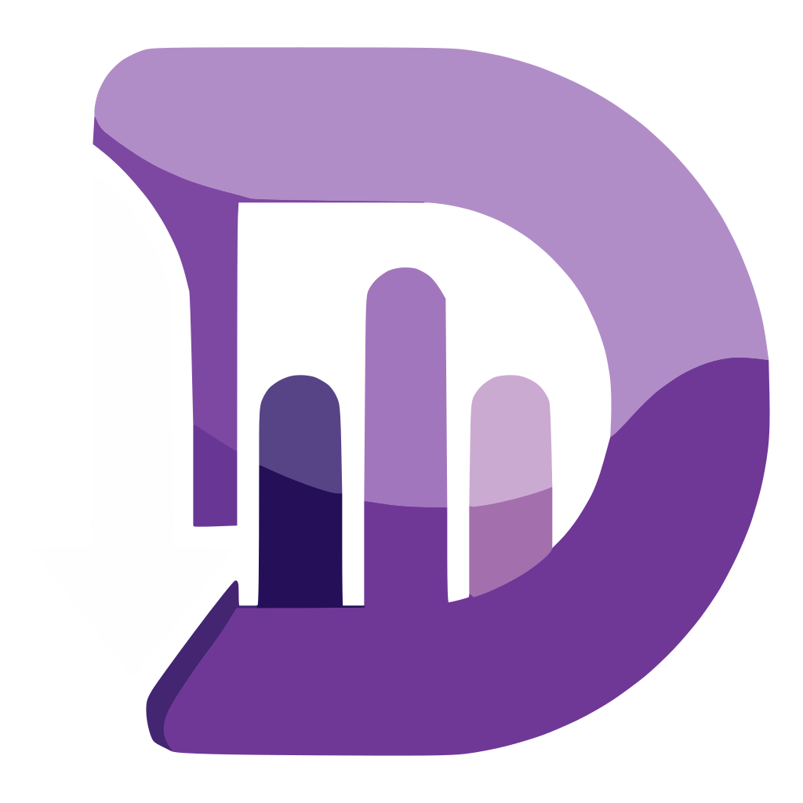

# Deezy

<p align="center">
  
</p>

A modern desktop Deezer downloader. Search for tracks, albums, artists, and playlists, paste Deezer URLs for direct download, and save music as high-quality MP3 or FLAC with full metadata and cover art.

[](https://discord.gg/dvuWBeXSf3)
[](https://github.com/PierrunoYT/Deezy/releases/latest)

---

## ⚠️ Important Information

**This tool is for educational and personal use only.** By using Deezy, you acknowledge and agree to the following:

- **Deezer Account Required** – You need a Deezer account (Free or Premium). The ARL token is tied to your account.
  - **Free accounts** are limited to MP3 128 kbps downloads
  - **Premium accounts** can download MP3 320 kbps or FLAC
- **Terms of Service** – Downloading music from Deezer may violate their [Terms of Service](https://www.deezer.com/legal/cgu). Use at your own risk.
- **Account Blocking Risk** – Your account may get suspended. Deezer can detect unusual download activity.
- **Copyright Laws** – Respect copyright laws in your jurisdiction. Downloaded content is for personal use only and must not be redistributed.
- **No Warranty** – This software is provided "as is". The authors are not responsible for any misuse or legal consequences.

**By using this software, you accept full responsibility for your actions.**

---

## Features

- **Search** – Find tracks, albums, artists, and playlists with debounced search
- **URL download** – Paste any Deezer link to download or queue it directly
- **Audio preview** – Play 30-second previews before downloading
- **Smart queue** – Up to 3 concurrent downloads with drag-and-drop reordering, pause/resume, and retry
- **Album & playlist download** – Download all tracks with one click
- **Quality options** – MP3 128, MP3 320, or FLAC with automatic fallback
- **Full metadata** – Title, artist, album, year, track number, genre, and 1000×1000 cover art embedded
- **Folder structure** – Organize downloads in 4 layouts: Flat, Artist/Track, Artist/Album/Track, Album/Track
- **Tag editor** – Edit metadata and cover art on any local MP3 or FLAC file
- **Download history** – Persistent history with CSV/JSON export and open-in-file-manager
- **Themes** – Light, Dark, System, and fully custom JSON themes
- **Internationalization** – English, Spanish, French, German, Portuguese, and Italian
- **Keyboard shortcuts** – Ctrl+F, Ctrl+1/2/3, Ctrl+H, Space, Shift+? and more
- **System tray** – Minimize to tray with download status and quick controls
- **Auto-update** – Check for and install updates directly from Settings
- **Secure credentials** – ARL token stored in OS credential store, never in plaintext

---

## Install

### Windows

Download the latest installer from the [Releases page](https://github.com/PierrunoYT/Deezy/releases/latest):

- `.exe` (NSIS installer) — recommended
- `.msi` (MSI package)

### macOS & Linux

No pre-built binaries are available yet. Build from source:

```bash
git clone https://github.com/PierrunoYT/Deezy.git
cd Deezy/deezy
npm install
npm run tauri build
```

Install the output from `src-tauri/target/release/bundle/` (`.dmg` on macOS, `.deb` / `.AppImage` on Linux).

> **macOS note:** Auto-update is not available — updates require rebuilding from source. Run `git pull` then `npm run tauri build` to update.

---

## Get your Deezer ARL token

1. Log into [deezer.com](https://www.deezer.com)
2. Open DevTools (`F12`) → **Application** (Chrome) or **Storage** (Firefox) → **Cookies** → `https://www.deezer.com`
3. Copy the value of the `arl` cookie (192-character string)

> Your ARL token is stored securely in your OS credential store (Windows Credential Manager / macOS Keychain / Linux Secret Service). It expires periodically and will need to be updated.

---

## Usage

1. **Setup** – Paste your ARL token, choose a download folder and quality, then click **Save & Login**
2. **Search** – Switch to Search (Ctrl+1), type a query, and press Enter
3. **Paste URLs** – Paste Deezer track, album, artist, or playlist links to download directly
4. **Preview** – Click ▶ to preview a track; Space bar to play/pause
5. **Download** – Click the download button on a track, or **Download All** on an album or playlist
6. **Manage Queue** – Drag to reorder, pause/resume, or remove pending downloads (Ctrl+2)
7. **History** – View completed downloads, open files in Explorer/Finder, or export history
8. **Customize** – Change theme, language, folder structure, and notifications in Settings (Ctrl+3)
9. **Updates** – Click **Check for Updates** in Settings to install the latest version
10. **Tray** – Minimize to tray (Ctrl+H); double-click the icon to restore

---

## License

MIT – see [LICENSE](LICENSE) for details.

## Resources

- [FAQ](FAQ.md) – Common questions about setup, security, and legal use
- [Changelog](CHANGELOG.md) – Full version history
